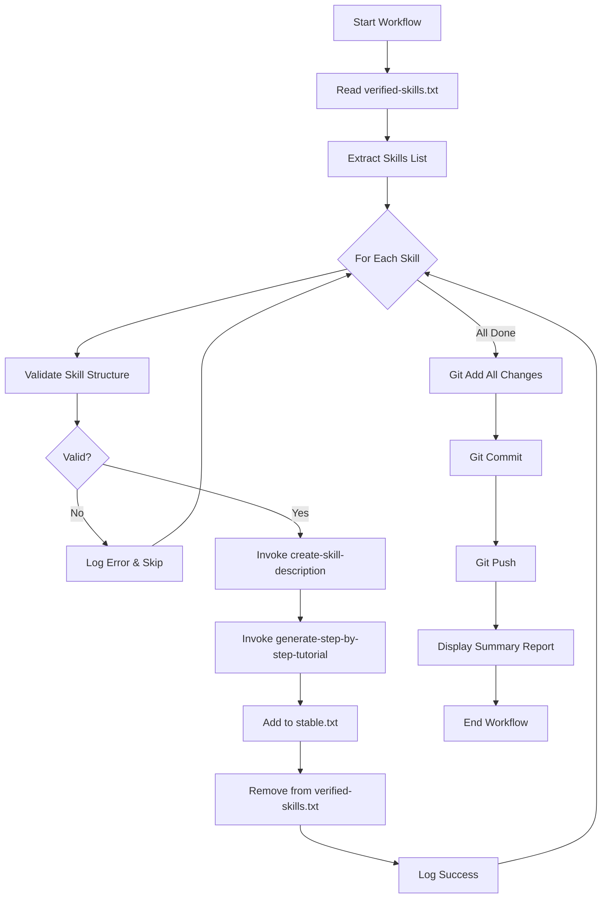

# Design Document: Automated Skill Documentation

## Overview

This design describes an AI agent workflow that regenerates documentation for all curated skills. The workflow orchestrates existing documentation generation skills (create-skill-description and generate-step-by-step-tutorial) to batch-process skills, update tracking files (stable.txt, verified-skills.txt), and commit/push changes to trigger the GitHub workflow for catalog rebuild.

## Architecture

The system follows a sequential batch processing architecture where an AI agent orchestrates the documentation generation workflow without custom code.



## Components and Interfaces

### 1. Skills List Parser Component

**Purpose**: Extract skill names from verified-skills.txt

**Interface**:
- Input: Path to verified-skills.txt
- Output: List of skill names

**Logic**:
1. Read verified-skills.txt file content
2. Parse each line to extract skill names (one per line)
3. Return list of skill names (e.g., ["analyze-contributor-risk", "analyze-function-complexity", ...])

### 2. Skill Validator Component

**Purpose**: Verify skill directory structure before documentation generation

**Interface**:
- Input: Skill name
- Output: Validation result (valid/invalid with reason)

**Logic**:
1. Check if directory `[skill-name]/` exists at workspace root
2. Check if `[skill-name]/skill.md` file exists
3. Return validation status

### 3. Description Generator Orchestrator

**Purpose**: Invoke the create-skill-description skill

**Interface**:
- Input: Skill name
- Output: Success/failure status

**Invocation**:
```
Skill: create-skill-description
Parameters:
  - skill_name: [skill-name]
```

**Expected Output**: File created at `[skill-name]/docs/description.md`

### 4. Tutorial Generator Orchestrator

**Purpose**: Invoke the generate-step-by-step-tutorial skill

**Interface**:
- Input: Skill name, skill.md path
- Output: Success/failure status

**Invocation**:
```
Skill: generate-step-by-step-tutorial
Parameters:
  - source_type: "file"
  - source_file: "[skill-name]/skill.md"
  - workflow_name: "[skill-name]"
```

**Expected Output**: File created at `[skill-name]/docs/tutorial.md`

### 5. Stable File Manager

**Purpose**: Add successfully documented skills to stable.txt

**Interface**:
- Input: Skill name
- Output: Success/failure status

**Logic**:
1. Read current stable.txt content
2. Check if skill already exists (skip if yes)
3. Add skill name to list
4. Sort alphabetically
5. Write back to stable.txt

### 6. Verified Skills File Manager

**Purpose**: Remove documented skills from verified-skills.txt

**Interface**:
- Input: Skill name
- Output: Success/failure status

**Logic**:
1. Read current verified-skills.txt content
2. Filter out the skill name line
3. Write back to verified-skills.txt
4. Log warning if skill not found

### 7. Git Operations Manager

**Purpose**: Stage, commit, and push all changes

**Interface**:
- Input: Number of skills processed
- Output: Success/failure status

**Commands**:
```bash
git add .
git commit -m "docs: regenerate documentation for [N] curated skills"
git push
```

## Data Models

### Skill Processing State (In-Memory Only)

The workflow tracks state in-memory during execution, no intermediate files are created:

```
SkillState:
  - name: string
  - status: "pending" | "completed" | "failed"
  - error: string | null
```

### Progress Tracking (Console Output Only)

Progress is displayed to console only, no files are created:
- Current skill being processed
- Success/failure status per skill
- Final count summary


## Correctness Properties

*A property is a characteristic or behavior that should hold true across all valid executions of a system—essentially, a formal statement about what the system should do. Properties serve as the bridge between human-readable specifications and machine-verifiable correctness guarantees.*

### Property 1: Skills List Parsing Completeness

*For any* verified-skills.txt file containing N skill names (one per line), the parser SHALL extract exactly N skill names.

**Validates: Requirements 1.2, 1.3**

### Property 2: Skill Validation Correctness

*For any* skill name, the validator SHALL return valid if and only if both the skill directory exists AND the skill.md file exists within that directory.

**Validates: Requirements 2.1, 2.2, 2.5**

### Property 3: Documentation File Creation

*For any* successfully processed skill, after invoking both documentation generation skills, the files [skill-name]/docs/description.md AND [skill-name]/docs/tutorial.md SHALL exist.

**Validates: Requirements 3.3, 4.3**

### Property 4: Stable File Management

*For any* skill added to stable.txt, the file SHALL contain the skill name exactly once, and all entries SHALL be in alphabetical order.

**Validates: Requirements 5.1, 5.2, 5.3, 5.4**

### Property 5: Verified Skills File Management

*For any* skill that is added to stable.txt, that skill name SHALL NOT appear in verified-skills.txt after the operation completes.

**Validates: Requirements 6.1, 6.3**

### Property 6: Workflow Completeness

*For any* list of N valid curated skills, the workflow SHALL process all N skills, and for each successful skill: generate description, generate tutorial, add to stable.txt, and remove from verified-skills.txt.

**Validates: Requirements 7.1, 7.2**

## Error Handling

### Skill Validation Errors

| Error Condition | Handling |
|----------------|----------|
| Skill directory not found | Log error with path, skip skill, continue to next |
| skill.md file not found | Log error with path, skip skill, continue to next |

### Documentation Generation Errors

| Error Condition | Handling |
|----------------|----------|
| create-skill-description fails | Log error from skill, skip to tutorial generation |
| generate-step-by-step-tutorial fails | Log error from skill, continue to stable.txt update |
| Both generations fail | Log errors, skip stable.txt/verified-skills.txt updates, continue to next skill |

### File Operation Errors

| Error Condition | Handling |
|----------------|----------|
| Cannot read stable.txt | Log error, skip stable.txt update, continue |
| Cannot write stable.txt | Log error, continue to verified-skills.txt |
| Cannot read verified-skills.txt | Log warning, continue |
| Cannot write verified-skills.txt | Log error, continue to next skill |

### Git Operation Errors

| Error Condition | Handling |
|----------------|----------|
| git add fails | Log error with output, abort git operations |
| git commit fails | Log error with output, abort push |
| git push fails | Log error with output, report to user |

## Testing Strategy

### Unit Tests

Since this is an AI agent workflow without custom code, traditional unit tests are not applicable. Instead, verification is done through:

1. **Manual verification** of generated documentation files
2. **File existence checks** after each skill processing
3. **Content validation** of stable.txt and verified-skills.txt

### Integration Tests

The workflow can be tested by:

1. Running on a subset of skills first
2. Verifying all expected files are created
3. Checking git commit history for correct message format
4. Verifying GitHub workflow triggers correctly on push

### Property-Based Testing

Not applicable for this AI agent workflow as there is no custom code to test. The properties defined above serve as verification criteria for manual review.

## Workflow Execution Steps

### Per-Skill Processing Loop

For each curated skill:

```
1. VALIDATE
   - Check [skill-name]/ directory exists
   - Check [skill-name]/skill.md exists
   - If invalid: log error, skip to next skill

2. GENERATE DESCRIPTION
   - Invoke: create-skill-description skill_name=[skill-name]
   - Verify: [skill-name]/docs/description.md exists
   - If failed: log error, continue

3. GENERATE TUTORIAL
   - Invoke: generate-step-by-step-tutorial source_type=file source_file=[skill-name]/skill.md workflow_name=[skill-name]
   - Verify: [skill-name]/docs/tutorial.md exists
   - If failed: log error, continue

4. UPDATE STABLE.TXT
   - Read stable.txt
   - Add skill name if not present
   - Sort alphabetically
   - Write stable.txt

5. UPDATE VERIFIED-SKILLS.TXT
   - Read verified-skills.txt
   - Remove skill name line
   - Write verified-skills.txt

6. LOG SUCCESS
   - Record skill as completed
   - Display progress
```

### Post-Processing

After all skills are processed:

```
1. GIT OPERATIONS
   - git add .
   - git commit -m "docs: regenerate documentation for [N] curated skills"
   - git push

2. CONSOLE OUTPUT
   - Display total skills processed
   - Display successful/failed counts
```

## Notes

- The workflow relies on existing skills (create-skill-description, generate-step-by-step-tutorial) for documentation generation
- No custom code is written; the AI agent orchestrates the workflow
- No intermediate files or summary reports are created - all tracking is in-memory or console output
- GitHub workflow automatically rebuilds catalog.md and mkdocs site on push
- Errors in one skill do not stop processing of remaining skills
