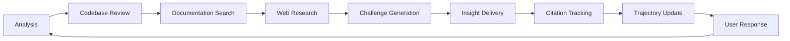

# Challenge Me Skill - User Guide

**Version**: 2.0 (Enhanced Multi-Source Research)
**Last Updated**: 2025-11-19
**Skill Path**: `skills/challenge-me/prompts/challenge-me.md`

## Overview

The Challenge Me skill is an interactive ideation engine that challenges your ideas, provides insights, and tracks collaborative refinement through iterative cycles. The enhanced version integrates multiple research sources including local codebases, documentation, and web resources to provide evidence-based challenges and insights.

## How It Works

```mermaid
flowchart TD
    A[User Request: "challenge me"] --> B[Parameter Collection]
    B --> C[Session Initialization]
    C --> D[Multi-Source Setup]
    D --> E[Iterative Cycles]
    E --> F{User Says Stop/Save?}
    F -->|No| G[Next Cycle]
    F -->|Yes| H[Generate Deliverables]

    D --> D1[Scan Codebase]
    D --> D2[Index Documentation]
    D --> D3[Prepare Web Search]

    G --> G1[Analyze Current Ideas]
    G --> G2[Research Codebase]
    G --> G3[Review Documentation]
    G --> G4[Web Research]
    G --> G5[Present Challenges]
    G --> G6[Generate Insights]
    G --> G7[Track Citations]
    G --> G8[Update Trajectory]
    G8 --> E

    H --> H1[think.md]
    H --> H2[path.md]
    H --> H3[sources.md]
    H --> H4[reco.md]
```

## Getting Started

### Basic Usage
Simply type: `olaf challenge me`

The system will prompt you for required parameters:

### Required Parameters
- **Subject**: The topic or subject area for ideation
- **Initial Thoughts**: Your starting ideas or description

### Optional Parameters
- **Codebase Path**: Path to local repository/codebase for analysis
- **Documentation Path**: Path to folder containing relevant documentation
- **Web Search URLs**: Specific URLs for research or leave empty for general search
- **Research Depth**: shallow|moderate|deep (default: moderate)
- **Challenge Intensity**: gentle|moderate|rigorous (default: moderate)

### Example Session Start
```
User: olaf challenge me
Agent: I'll help you with an interactive ideation session. I need some information to get started:

**Subject**: What topic would you like to explore? (REQUIRED)
**Initial Thoughts**: What are your current ideas or thoughts on this topic? (REQUIRED)
**Codebase Path**: Do you have a local repository I should analyze? (Optional - provide path)
**Documentation Path**: Any documentation folder I should review? (Optional - provide path)
**Web Search URLs**: Specific URLs to research, or leave empty for general search (Optional)
**Research Depth**: How deep should I research? (shallow/moderate/deep - default: moderate)
**Challenge Intensity**: How aggressively should I challenge ideas? (gentle/moderate/rigorous - default: moderate)

User:
Subject: API design patterns for microservices
Initial Thoughts: I'm thinking about using REST APIs with JSON, but wondering about GraphQL and event-driven patterns
Codebase Path: ./my-microservices-project
Documentation Path: ./docs/architecture
Web Search URLs: (leave empty for general search)
```

## Session Flow

### 1. Session Initialization
The system creates a unique session identifier and sets up multi-source research:

```
Session ID: api-design-patterns-20251119-1653
✓ Codebase scanned: ./my-microservices-project (15 services found)
✓ Documentation indexed: ./docs/architecture (8 documents)
✓ Web search strategy: General API design research
✓ Citation tracking initialized
```

### 2. Iterative Cycles

Each cycle follows this structure:



## Output Files

When you say "save", the system generates four files in `[staging_dir]/think-tank/<subject-3-words>-YYYYMMDD-HHMM/`:

### 1. think.md - Final Refined Ideas
Contains your final conclusions with source attribution

### 2. path.md - Evolution Trajectory
Documents how your thinking evolved through the session

### 3. sources.md - Comprehensive Citations
Complete citation database organized by source type

### 4. reco.md - Actionable Recommendations
Honest, actionable recommendations based on all cycle exchanges including go/no-go decisions and alternatives

## Enhanced Collaborative Features

### Interactive Question Formats
The system uses specific formatting for different types of engagement:

**Numbered Lists (1, 2, 3, 4)** for:
- Choice-based questions (selecting between options)
- Priority rankings and polls
- Decision-oriented prompts

**Lettered Lists (A, B, C, D)** for:
- Clarification questions (what do you mean by...?)
- Vision/perspective requests (how do you see...?)
- Understanding checks (which resonates with you?)

### Collaborative Engagement Rules
- **Never repeats questions** - always builds on previous responses
- **Presents web feedback** and asks for your perspective
- **Invites explanation** rather than making assumptions
- **Uses multiple-choice formats** to keep you actively involved
- **Builds trajectory** based on your responses and reasoning

## Advanced Features

### Citation Tracking
Every insight and challenge is backed by specific sources:
- **Code references**: File paths, line numbers, specific functions
- **Documentation**: Document names, sections, page numbers
- **Web resources**: Full URLs, titles, access timestamps

### Multi-Source Synthesis
The system combines findings from all sources to provide:
- **Evidence-based challenges** grounded in your actual codebase
- **Contextual insights** informed by your documentation
- **Industry-validated approaches** from web research

### Honest Recommendations System
Every session now produces actionable recommendations that can include:
- **Go/No-Go decisions** with clear reasoning
- **Alternative approaches** if current path isn't recommended
- **Negative recommendations** ("don't do it" with alternatives)
- **Risk assessments** and mitigation strategies
- **Specific next steps** with timelines and resources

## Best Practices

### Preparing for a Session
1. **Organize your codebase**: Ensure the path is accessible and well-structured
2. **Prepare documentation**: Have relevant docs in a single folder
3. **Define clear scope**: Be specific about what aspect you want to explore
4. **Set realistic expectations**: Complex topics may need multiple sessions

### During the Session
1. **Engage actively**: Respond thoughtfully to challenges
2. **Ask for clarification**: If sources seem unclear, ask for specifics
3. **Challenge back**: The system learns from your pushback
4. **Request deeper dives**: Ask to explore specific sources more thoroughly

### After the Session
1. **Review all four files**: Each provides different value
2. **Follow citation trails**: Explore referenced sources independently
3. **Plan implementation**: Use insights for concrete next steps
4. **Schedule follow-ups**: Complex topics benefit from multiple sessions

## Troubleshooting

### Common Issues

**"Codebase path not found"**
- Verify the path is correct and accessible
- Use relative paths from your current directory
- The system will continue without codebase analysis if needed

**"Too many sources overwhelming the discussion"**
- Request focus on specific source types
- Ask for prioritization of most relevant sources
- Use "shallow" research depth for simpler sessions

**"Citations seem incomplete"**
- The system maintains manual backups if tracking fails
- Request specific source verification during cycles
- Check sources.md for comprehensive citation database

**"Cycles becoming repetitive"**
- Ask for new research angles or unexplored sources
- Request deeper analysis of specific findings
- Consider switching to different documentation areas

### Getting Help
- Use "explain your reasoning" to understand source selection
- Ask "what sources are you consulting?" for transparency
- Request "show me the specific code/doc section" for verification

---

*This guide covers the enhanced Challenge Me skill with collaborative engagement, comprehensive source tracking, and honest recommendations. The system will actively involve you in the ideation process while providing evidence-based insights and actionable outcomes.*