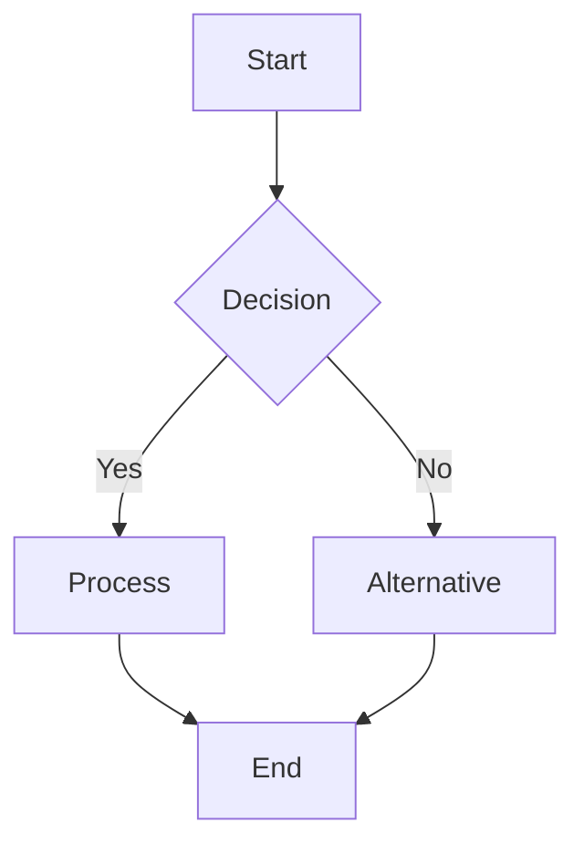
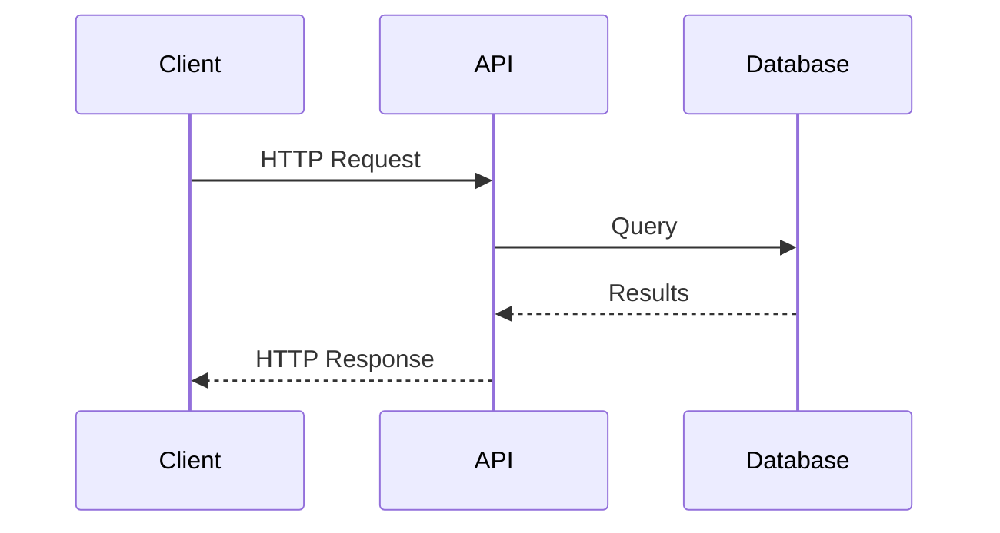
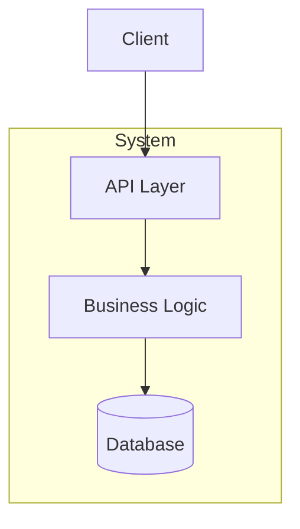

<olaf>

**MANDATORY**: before doing anything else, read fully the `.olaf/team-delegation.md` file and apply its requirements strictly.

# Onboard-Me: Adaptive Repository Onboarding

## Workflow

1. Run: `python skills/onboard-me/tools/analyze-repository.py <repo-path> --output .olaf/work/onboard-me`
   - This script is **discovery-only**. It MUST NOT generate any guides by itself.
   - **If you can execute terminal commands, you MUST run this command yourself instead of asking the user to run it manually.**
2. Read: `.olaf/work/onboard-me/repository-analysis.json`
   - **You (the skill) MUST parse this JSON and act on it directly. Do NOT wait for another tool.**
3. Detect personas (3-6 based on tech stack) **using the persona rules in this prompt**.
4. Generate: ONE guide per persona (`QUICKSTART-<PERSONA>.md`) in `.olaf/data/product/context/<repo-name>/` **by writing full Markdown files yourself using the Guide Template below and real data from the JSON (`languages`, `commands`, `entry_points`, `key_files`, `architecture`).**
5. Create: Overview file listing all guides in `.olaf/data/product/context/<repo-name>/` **by writing `QUICKSTART-OVERVIEW.md` yourself.**

---

## Persona Detection Rules

**Frontend Developer**: IF `TypeScript/JavaScript` + (`React` OR `Vue` OR `Angular` OR `Next.js`)  
**Backend Developer**: IF `Python` + (`FastAPI` OR `Django` OR `Flask`) OR `Go` with API frameworks  
**Mobile Developer**: IF `Kotlin` OR `Swift` OR `react-native`  
**VS Code Extension Developer**: IF `VS Code Extension` in frameworks  
**CLI Tool Developer**: IF `project_type == cli-tool` OR `Bubble Tea (TUI)`  
**DevOps Engineer**: IF `Docker` OR `kubernetes` OR `Terraform`  
**Data Engineer**: IF `Python` + (`pandas` OR `numpy` OR `tensorflow`) OR `Apache Spark` OR `Scala` with data processing  
**QA Engineer**: ALWAYS IF `architecture.has_tests == true`  
**Architect**: ALWAYS include  
**Business Analyst**: ALWAYS include  
**Docs Contributor**: ALWAYS include

---

## Guide Template

Generate ONE guide per persona with this structure:

````markdown
# {{repo_name}} - {{Persona}} Quick Start

**Get productive in 30 minutes**

## What You'll Build
{{Concrete task matching persona}}

---

## Your First 30 Minutes

### 1. Setup (5 min)
\`\`\`bash
{{commands.install}}
\`\`\`

### 2. Build & Run (5 min)
\`\`\`bash
{{commands.run OR commands.build}}
\`\`\`
**Verify**: {{How to confirm it worked}}

### 3. Understand the Code (10 min)
**Key files**:
- \`{{entry_points[persona_language][0]}}\` - {{Purpose}}
- \`{{relevant_directory}}/\` - {{Purpose}}

{{IF persona requires flow understanding, add Mermaid diagram}}
{{See "Mermaid Diagram Guidelines" section below}}

### 4. Make Your First Change (10 min)
**Task**: {{Specific, testable modification}}

**Steps**:
1. Open: \`{{file_path}}\`
2. Change: {{What to modify}}
3. Test: \`{{commands.test}}\`

---

## Common Tasks

### {{Task 1 Title}}
\`\`\`bash
{{commands_or_steps}}
\`\`\`

### {{Task 2 Title}}
\`\`\`bash
{{commands_or_steps}}
\`\`\`

### {{Task 3 Title}}
\`\`\`bash
{{commands_or_steps}}
\`\`\`

---

## Development Workflow

\`\`\`bash
git checkout -b feature/{{branch_name}}
{{edit_files}}
{{commands.test}}
git commit -m "{{commit_format}}"
\`\`\`

---

## Debugging

**Method 1**: {{Primary debug approach for this tech stack}}  
**Method 2**: {{Alternative approach}}

**Common Issues**:
- **Error**: {{Common error}}  
  **Fix**: {{Solution}}

---

## Resources

- Main docs: \`{{key_files.README.md}}\`
- Contributing: \`{{key_files.CONTRIBUTING.md}}\`

---

**Quick Reference**:
\`\`\`bash
{{key_commands_summary}}
\`\`\`
````

---

## Persona-Specific Adaptations

### Architect Guide
Focus on:
- **System overview**: High-level architecture diagram and component interactions
- **Technology decisions**: Why each framework/language was chosen
- **Data flow**: End-to-end data/request flow across components
- **Scalability patterns**: How the system handles growth
- **Integration points**: APIs, databases, external services
- **Design trade-offs**: Performance vs maintainability, etc.
- **Evolution strategy**: How to extend or refactor the system

### Business Analyst Guide
Focus on:
- **Business value**: What problem the system solves
- **Key features**: Main capabilities and user-facing functionality
- **Data model**: Business entities and their relationships
- **Workflows**: Step-by-step business processes implemented
- **Reporting/Analytics**: How to extract insights from the system
- **Configuration**: Business rules and settings
- **Non-technical overview**: Understanding the system without deep coding

**Diagrams**: ALWAYS include flowchart showing business process flow

---

## Mermaid Diagram Guidelines

**WHEN TO INCLUDE**:
- **Architect**: ALWAYS include architecture diagram (flowchart or C4 diagram)
- **Business Analyst**: ALWAYS include business workflow (flowchart)
- **Data Engineer**: Include data flow diagram for ETL pipelines
- **Backend Developer**: Include sequence diagram for API request flow
- **Frontend Developer**: Include component hierarchy or state flow
- **Other roles**: Include if it clarifies complex workflows

**DIAGRAM TYPES**:

1. **Flowchart** - Business processes, data pipelines, decision trees


2. **Sequence Diagram** - API calls, request/response flows, interaction between components


3. **Architecture Diagram** (C4 Container Level)


**PLACEMENT**: Insert diagrams in "Understand the Code" section after describing key files

**GUIDELINES**:
- Keep diagrams simple and focused (max 10 nodes)
- Use clear labels
- Match diagram type to persona's mental model
- Include brief explanation before diagram

---

## Project Type Adaptations

**web-app / frontend-app**: Hot-reload, browser debugging, component structure  
**backend-api**: API testing (curl), database setup, request/response flow  
**cli-tool**: Flag testing, binary building, command structure  
**library**: Example usage, packaging, API design  
**vscode-extension**: F5 debugging, Extension Dev Host, command registration  
**monorepo**: Component independence, workspace navigation, per-component personas

---

## Output Files

Create these files in `.olaf/data/product/context/<repo-name>/`:
1. `QUICKSTART-{{PERSONA}}.md` (one per detected persona)
2. `QUICKSTART-OVERVIEW.md` (summary with decision tree)

Store analysis JSON in `.olaf/work/onboard-me/repository-analysis.json`

---

## Execution Checklist

- [ ] Run analysis tool: `python skills/onboard-me/tools/analyze-repository.py <repo-path> --output .olaf/work/onboard-me` (for **facts discovery only**; **execute it yourself when tools/terminal are available, do NOT delegate this to the user**)
- [ ] Read `.olaf/work/onboard-me/repository-analysis.json` and **treat it as your primary input**
- [ ] Detect 3-6 personas using the rules in this prompt
- [ ] Generate one guide per persona in `.olaf/data/product/context/<repo-name>/` by **creating new Markdown files**
- [ ] Create overview file in `.olaf/data/product/context/<repo-name>/` by **creating `QUICKSTART-OVERVIEW.md` yourself**
- [ ] Use real commands from `commands{}` in JSON
- [ ] Use real file paths from `entry_points{}` and `key_files{}` in JSON

---

*Keep guides concise, actionable, and concrete. Every command should be copy-pasteable.*
