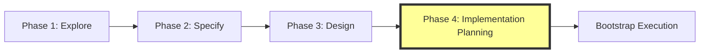

# Generate Implementation Plan Skill

## Overview

Transform specification + system design into a detailed, executable implementation task plan.

**Part of**: ESDI Workflow (Phase 4 - Implementation Planning with Requirement Traceability)  
**Protocol**: User approval gates at each phase  
**Version**: 2.0.0

---

## What It Does

This skill takes a **design.md** file (from `generate-design` skill) and produces a complete **IMPLEMENTATION-TASK-PLAN.md**.

Optional: it can also produce an execution-ready plan (Task 0.0 condensed contexts + bootstrap orchestration) *if you provide working prompt paths* for those tools.

**Key Features**:
- ✅ Extracts layers and components from design
- ✅ Can generate optional **Task 0.0** (condensed context extraction) when enabled
- ✅ Creates complete task breakdown with dependencies
- ✅ Generates execution information for every task
- ✅ Can include optional bootstrap orchestrator integration when enabled

---

## Input/Output

**Input**:
- `specification.md`: EARS requirements from Phase 2 (transform-raw-spec)
- `design.md`: Layered architecture design document from Phase 3 (generate-design)

**Output**:
- `IMPLEMENTATION-TASK-PLAN.md`: Complete implementation plan with:
  - Requirement traceability matrix
  - Coverage analysis
  - Optional Phase 0: Setup (only when enabled / required by design)
  - Phase 1-N: Layer implementations
  - Task execution information for all tasks
  - Optional bootstrap execution instructions
  - Estimated execution time

---

## Usage

### Via ESDI Workflow (Recommended)

The skill is automatically invoked in ESDI Phase 4.

Run complete ESDI workflow using the appropriate execution method for your environment.

ESDI will automatically:
1. Phase 1: Exploration (challenge-me)
2. Phase 2: Specification (transform-raw-spec)
3. Phase 3: Design (generate-design)
4. **Phase 4: Implementation Planning (THIS SKILL)**

### Standalone Usage

Execute the skill directly on an existing design.md:

**Task Prompt**: `skills/generate-implementation-plan/skill.md`

**Context Variables**:
- `specification_file`: Path to specification.md (required)
- `design_file`: Path to design.md (required)
- `output_file`: Where to write IMPLEMENTATION-TASK-PLAN.md (required)
- `skill_path`: Target path for skill (optional, defaults to `skills/${skill_name}`)
- `include_bootstrap`: Include bootstrap command (optional, default: true)

---

## Task Chain

The skill follows the **master-chain pattern** with 7 sequential tasks:

```yaml
Task 1: extract-requirements-and-design
  → Parse specification.md for EARS requirements
  → Parse design.md for layers/components
  → Create initial requirement-to-layer mapping
  → User approval gate

Task 2: generate-task-zero
  → Generate Task 0.0 specification
  → Follow onboarding 0.3 pattern
  → User approval gate

Task 3: create-task-breakdown
  → Map layers to phases
  → Generate task structure
  → Calculate dependencies
  → User approval gate

Task 4: validate-requirement-coverage
  → Map requirements to tasks
  → Generate traceability matrix
  → Identify gaps in coverage
  → User approval gate

Task 5: generate-execution-steps
  → Create execution information for all tasks
  → Define prompts, context, and dependencies
  → User approval gate

Task 6: create-bootstrap-integration
  → Generate bootstrap execution instructions
  → Add resume capability
  → User approval gate

Task 7: generate-plan-document
  → Assemble final IMPLEMENTATION-TASK-PLAN.md
  → Write to output_file
  → Act (no gate, final assembly)
```

**User Approval Gates**: User reviews and approves each phase before proceeding

---

## Output Structure

Generated IMPLEMENTATION-TASK-PLAN.md contains:

```markdown
# {Skill Name} Implementation Task Plan

## Overview
{From design}

## Execution Strategy
{How to execute tasks sequentially}

## Requirement Traceability Matrix
{Complete mapping of EARS requirements to implementation tasks}
{Coverage statistics and gap analysis}

## PHASE 0: Setup & Structure Creation
  ### Task 0.0: Extract Task Contexts [CRITICAL - FIRST]
  ### Task 0.1: Create Skill Directory Structure
  ### Task 0.2: Create Master Coordinator Prompt

## PHASE 1: Layer 1 - {Layer Name}
  ### Task 1.1: {Component Implementation}
  ### Task 1.2: {Component Implementation}
  ### Task 1.N: Validate Layer Outputs

## PHASE N: Layer N - {Layer Name}
  {Same pattern}

## Bootstrap Execution
{Bootstrap orchestrator command}
{Resume command pattern}

## Summary
{Stats and completion criteria}
```

---

## Task 0.0 (Optional)

Task 0.0 is OPTIONAL and only applies when you want bootstrap-style execution with condensed per-task contexts.

```markdown
## Task 0.0: Extract Task Contexts

**CRITICAL**: Execute FIRST before all other tasks

**Purpose**: Generate condensed context files (~500 tokens) for universal prompt generator

**Task Prompt**:  
`{task_context_extractor_prompt}`

**Context**:  
`bootstrap_doc={plan_path},skill_path={skill_path}`

**Outputs**:
- {skill_path}/tasks/contexts/task-{N}-context.md (one per task)
- ~97% size reduction (50KB → 500 tokens)
- Enables fast, reliable prompt generation
```

**Why Task 0.0**:
- Universal prompt generator needs condensed context
- Avoids token limit issues (50KB → 500 tokens)
- 3x faster prompt generation (600s vs 1800s)
- This is a general condensed-context pattern; the extractor prompt must exist in your environment.

---

## Dependencies

**Required Skills**:
- ✅ `generate-design` (produces design.md input)

**Optional Infrastructure (ONLY if you enable bootstrap execution)**:
- ✅ Bootstrap orchestrator (`{bootstrap_orchestrator_prompt}`)
- ✅ Task context extractor (`{task_context_extractor_prompt}`)

---

## Example End-to-End

### 1. Run ESDI to Generate Plan

Execute the ESDI workflow with your chosen execution method:
- **Context**: `idea=Repository scanner system,topic=repo-scanner`
- **Output**: `.olaf/work/staging/esdi/20251122-repo-scanner/IMPLEMENTATION-TASK-PLAN.md`

### 2. Execute Task 0.0

**Task Prompt**: `{task_context_extractor_prompt}`  
**Context**: `bootstrap_doc=.olaf/work/staging/esdi/20251122-repo-scanner/IMPLEMENTATION-TASK-PLAN.md,deliverable_root=skills/repo-scanner`  
**Output**: `skills/repo-scanner/tasks/contexts/task-*.md` (47 files)

### 3. Execute Bootstrap

**Task Prompt**: `{bootstrap_orchestrator_prompt}`  
**Context**: `bootstrap_doc=.olaf/work/staging/esdi/20251122-repo-scanner/IMPLEMENTATION-TASK-PLAN.md,checklist_path=.olaf/work/project-tasks/task-checklist.md`  
**Result**: Fully implemented `repo-scanner` skill in `skills/repo-scanner/`

---

## Knowledge Base

- **task-planning-patterns.md**: 8 patterns for task decomposition
- **execution-templates.md**: Templates for task execution information

### Key Patterns

1. **Layer-to-Phase Mapping**: Each design layer → implementation phase
2. **Phase 0 Pattern**: Setup tasks (0.0, 0.1, 0.2) for every plan
  - Now: Phase 0 is optional and should not be forced unless requested
3. **Task Breakdown**: Components → tasks with integration/validation
4. **Dependency Management**: Sequential phases, parallel tasks within phases
5. **Bootstrap Integration**: Autonomous execution via bootstrap orchestrator

---

## Success Criteria

✅ **All EARS requirements** extracted from Phase 2 specification
✅ **Requirement traceability matrix** generated
✅ **Requirement coverage** validated (≥95% recommended)
✅ **Task 0.0 included** with onboarding 0.3 pattern
✅ **All layers mapped** to implementation phases with requirement references
✅ **Task execution information** generated for every task
✅ **Bootstrap integration** command provided
✅ **Dependencies** properly sequenced
✅ **Ready for execution** via bootstrap orchestrator---

## Integration with ESDI



**This skill** is Phase 4 of the ESDI workflow:
1. Exploration → findings
2. Specification → EARS spec
3. Design → layered architecture
4. **Implementation Planning** → executable task plan (THIS SKILL)
5. Bootstrap → autonomous execution

---

## Limitations

- Requires design.md in specific format (layered architecture)
- Task 0.0 must be run manually before bootstrap
- Assumes sequential layer dependencies (no circular deps)
- Optimized for structured task-based implementations

---

## Future Enhancements

- [ ] Auto-detect optimal task grouping (avoid >100 tasks)
- [ ] Parallel task execution planning (identify independence)
- [ ] Cost/time estimation per task
- [ ] Dependency graph visualization
- [ ] Support for non-layered architectures

---

## Files

```
generate-implementation-plan/
├── skill.md
├── README.md (this file)
├── tasks/
│   ├── extract-requirements-and-design.md (Task 1)
│   ├── generate-task-zero.md (Task 2)
│   ├── create-task-breakdown.md (Task 3)
│   ├── validate-requirement-coverage.md (Task 4)
│   ├── generate-execution-steps.md (Task 5)
│   ├── create-bootstrap-integration.md (Task 6)
│   └── generate-plan-document.md (Task 7)
├── kb/
│   ├── task-planning-patterns.md
│   └── straf-command-templates.md
└── templates/
    ├── implementation-plan-template.md
    └── bootstrap-command-template.md
```

---

## Support

For issues or questions:
- Review task-planning-patterns.md for common scenarios
- Check runner template guidance for execution patterns
- Verify design.md follows expected format
- Ensure Task 0.0 completes before bootstrap

---

**Status**: ✅ Active  
**Maintained by**: OLAF Framework Core Team  
**Last Updated**: 2025-11-22
