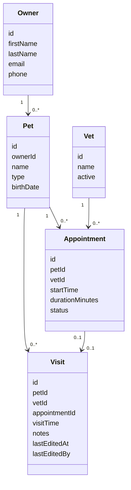
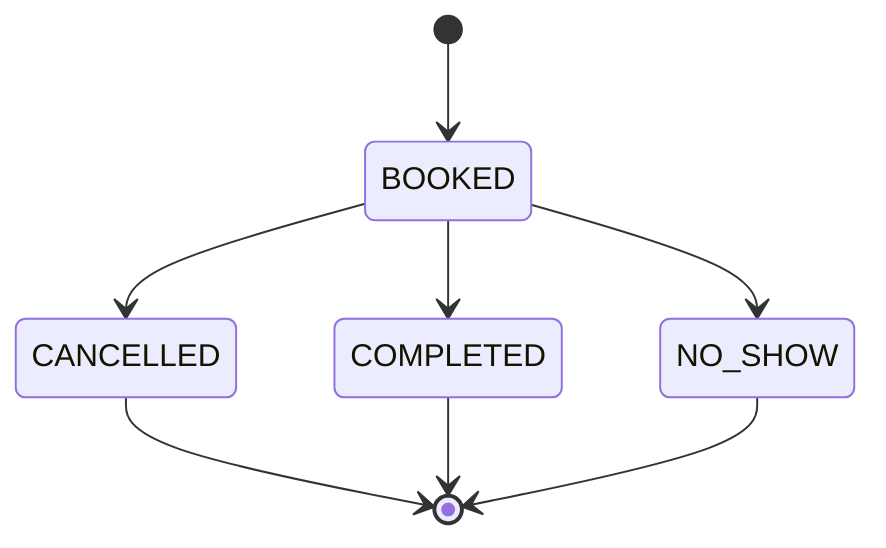
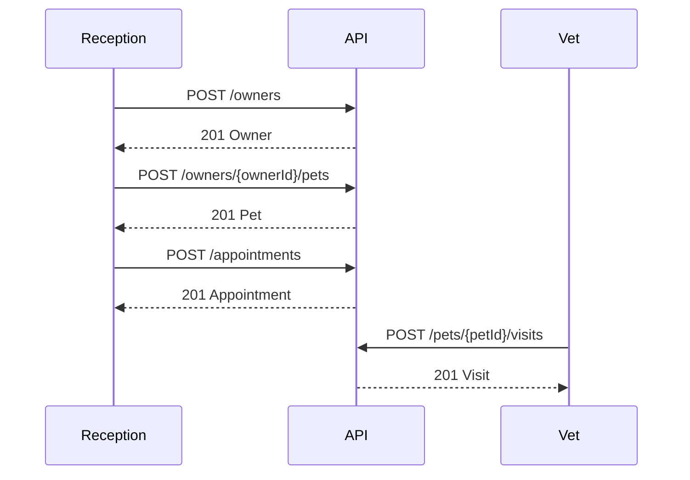
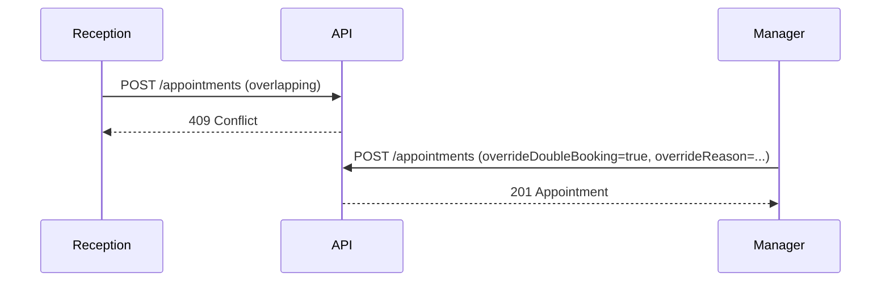

# Pet Clinic API — Functional Specification (Detailed)

## 1) Metadata & traceability
- Demand folder:
- Demand input:
- Approved decisions:
- Spec timestamp (YYYYMMDD-HHmm):
- Target audience:

## 2) Goals, scope, and non-goals

## 3) Roles & permissions (RBAC)
Provide a role-to-capability mapping and an endpoint-level RBAC matrix.

## 4) Domain model

### 4.1 Entities & relationships (Mermaid)

### 4.2 Appointment lifecycle (Mermaid)

## 5) Key business rules (testable)
Include validation rules, constraints, and expected error behaviors.

## 6) Core workflows (Mermaid)

### 6.1 Happy path: create owner → add pet → book appointment → record visit

### 6.2 Scheduling conflict: double-book hard block; manager override

## 7) Endpoint behavior details
For each resource, specify:
- Request fields, required/optional
- Validation rules
- Response shape
- Error cases (400/401/403/404/409)

## 8) Data conventions
- Timezone handling
- Pagination
- Audit fields

## 9) Examples
Provide example requests/responses for the trickiest flows (duplicate owner warn; double-book override; visit edit).
